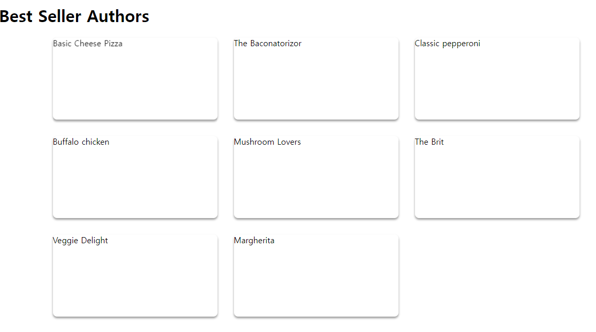
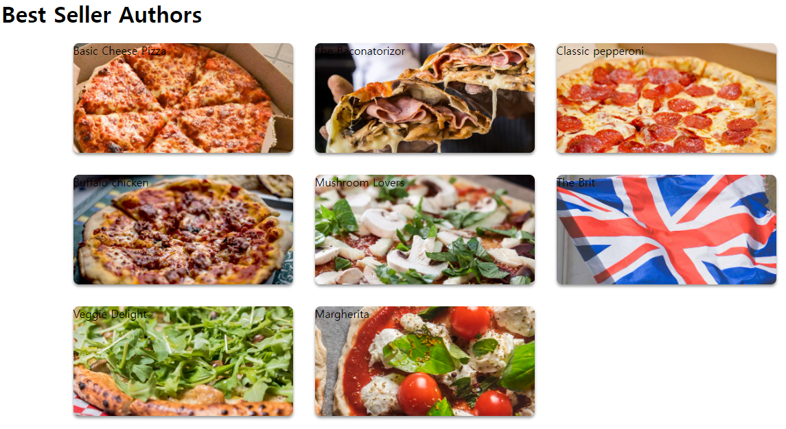

# 피자 메뉴 목록 표시
피자 메뉴를 표시하는 것 부터 진행하도록 하겠습니다.
App.tsx 파일을 아래와 같이 수정합니다.
```tsx
import styled from "styled-components";
import { pizzas } from "./db";

const PizzaCards = styled.ul`
  display: grid;
  grid-template-columns: repeat(auto-fill, 20rem);
  grid-gap: 2rem;
  justify-content: center;
  padding-left: 0;
`;
const PizzaItem = styled.li`
  height: 10rem;
  position: inherit;
  background-size: cover;
  border-radius: 0.5rem;
  list-style-type: none;
  box-shadow: 0 3px 4px rgba(0, 0, 0, 0.4);
  transition: 0.1s ease-out;
  &:hover {
    transform: scale(1.02);
  }
`;

function App() {
  return (
    <div>
      <h1>Best Seller Authors</h1>
      <PizzaCards>
        {pizzas.map((pizza) => (
          <PizzaItem key={pizza.id}>{pizza.name}</PizzaItem>
        ))}
      </PizzaCards>
    </div>
  );
}

export default App;
```
아래 화면을 보시면 아직 이미지나 글자가 원하는대로 출력되지 않고 있네요.


App.tsx 파일에 다음을 추가합니다.
```tsx
interface PizzaItemProps {
  imgUrl: string;
}
```
이제 `PizzaItem`의 `styled.li`에 `PizzaItemProps` 인터페이스를 주입하고,
`App()`의 `PizzaItem`에 이미지url을 추가해 줍니다.
```tsx
const PizzaItem = styled.li<PizzaItemProps>`
    // 생략
    background-image: ${(props) => `url(${props.imgUrl || null})`};
    // 생략
`
function App() {
    // 생략
          <PizzaItem key={pizza.id} imgUrl={pizza.imageUrl}>
            {pizza.name}
          </PizzaItem>
    // 생략
}
```
아래 화면을 보시면 이미지는 추가되어 잘 보입니다.


이제 피자메뉴에 피자이름, 설명, 가격을 표시하도록 하겠습니다.
```tsx
const PizzaItem = styled.li<PizzaItemProps>`
    // 하단에 입력
  .pizza-info {
    position: absolute;
    top: 0;
    left: 0;
    right: 0;
    bottom: 0;
    background: linear-gradient(rgba(0, 0, 0, 0.7) 30%, rgba(0, 0, 0, 0) 80%);
    padding: 1rem;
    color: #fff2cc;
    cursor: pointer;
    text-shadow: 0 2px 2px rgba(0, 0, 0, 0.5);
    line-height: 1.25rem;

    .pizza-title {
      color: white;
      font-size: 1.4rem;
      margin: 0.2rem 0 0.4rem 0;
      font-family: "Bahnschrift", Arial, Helvetica, sans-serif;
      text-transform: uppercase;
    }

    .pizza-price {
      position: absolute;
      bottom: 0.5rem;
      right: 1rem;
      font-size: 1.5rem;
      font-weight: 700;
      padding: 0rem 0.7rem;
      border-radius: 4px;
      background-color: #08af08;
      color: white;
      line-height: 2rem;
    }
  }
  `
  // 생략

  function App() {
  return (
    <div>
      <h1>Best Seller Authors</h1>
      <PizzaCards>
        {pizzas.map((pizza) => (
          <PizzaItem key={pizza.id} imgUrl={pizza.imageUrl}>
            <div className="pizza-info">
              <div className="pizza-title">{pizza.name}</div>
              <div className="pizza-description">{pizza.description}</div>
              <div className="pizza-price">£{pizza.basePrice}</div>
            </div>
          </PizzaItem>
        ))}
      </PizzaCards>
    </div>
  );
}
  ```

# Header.tsx 만들기
상단에 메뉴를 표시할 header를 생성합니다.

`..\src\components\Header.tsx`
