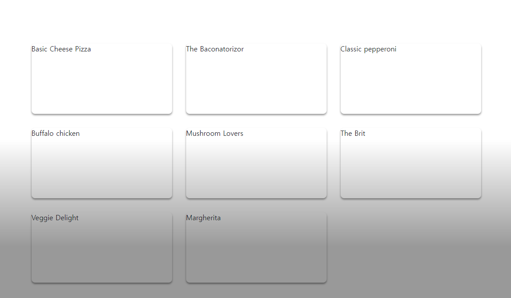
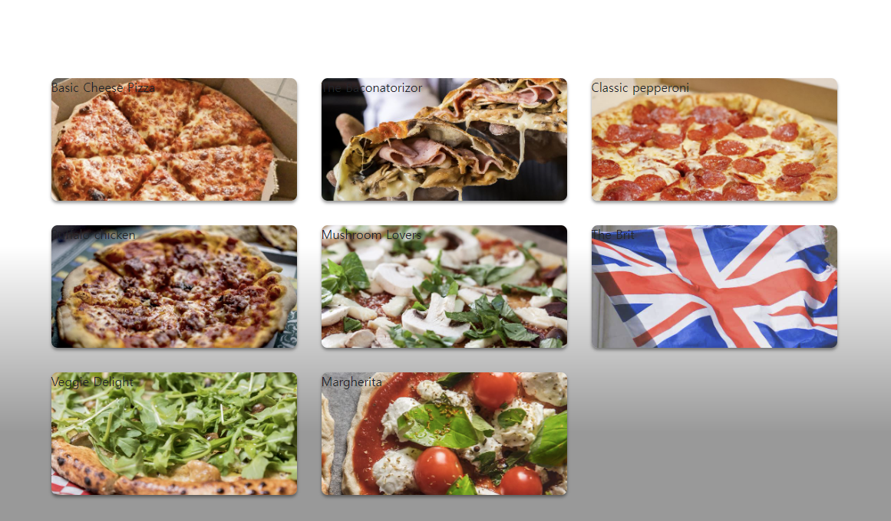
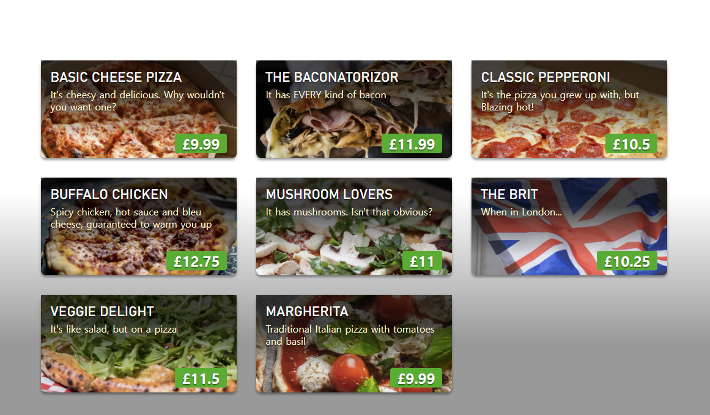
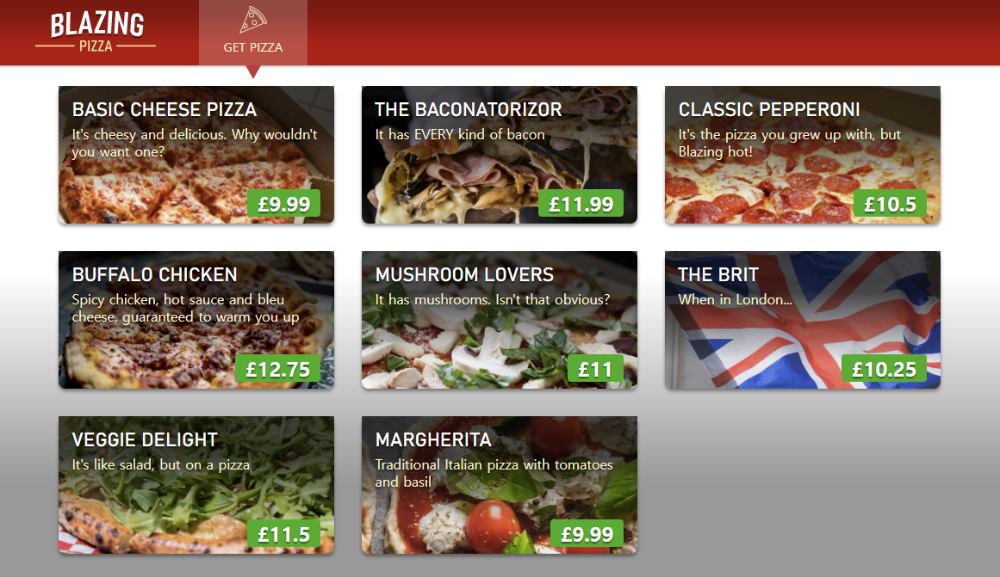

> node_modules 폴더가 없거나 실행이 잘 안된다면<br>
> [README.md](..\README.md#먼저-해야할-일)파일을 참조하셔서 node_modules를 설치해야 합니다.

# 00-get-started
처음 react를 설치하고, 기본적인 설정들을 실행하고 나서 아래의 기본적인 폴더와 파일들을 세팅해놓은 상태 입니다.
1. `public/bootstrap/bootstrap.min.css`
2. `public/bootstrap/bootstrap.min.css.map`
3. `public/bootstrap/leaflet.css`
4. `index.html`에 `css` 추가
5. `images`폴더 추가
6. `src/db.ts` 파일 추가
7. 불필요한 파일들 삭제

기본 설정은 되었으니, 지금부터 아래 안내에 따라 피자앱을 하나씩 만들어 보겠습니다.

`00-get-started`가 끝나고 나면 `save-points`의 `01-components`와 같은 상태가 됩니다.

---
<br>
<br>

# 피자 메뉴 목록 표시
피자 메뉴를 표시하는 것 부터 진행하도록 하겠습니다.
App.tsx 파일을 아래와 같이 수정합니다.
```tsx
import styled from "styled-components";
import { pizzas } from "./db";
// Container와 Main은 Blazor에서 옮기면서 기존 설정을 유지한 것입니다.
const Container = styled.div`
  display: flex;
  height: 100%;
  z-index: 1;
  background-color: white;
`;
const Main = styled.div`
  flex-grow: 1;
  overflow-y: auto;
  background: linear-gradient(rgba(0, 0, 0, 0) 40%, rgba(0, 0, 0, 0.4) 80%);
  padding: 1.5rem !important;
`;
// -------------------------------
const PizzaCards = styled.ul`
  display: grid;
  grid-template-columns: repeat(auto-fill, 20rem);
  grid-gap: 2rem;
  justify-content: center;
  padding-left: 0;
`;
const PizzaItem = styled.li`
  height: 10rem;
  position: inherit;
  background-size: cover;
  border-radius: 0.5rem;
  list-style-type: none;
  box-shadow: 0 3px 4px rgba(0, 0, 0, 0.4);
  transition: 0.1s ease-out;

  &:hover {
    transform: scale(1.02);
  }
`;

function App() {
  return (
    <div>
      <Container>
        <Main>
          <PizzaCards>
            {pizzas.map((pizza) => (
              <PizzaItem key={pizza.id}>{pizza.name}</PizzaItem>
            ))}
          </PizzaCards>
        </Main>
      </Container>
    </div>
  );
}

export default App;
```
아래 화면을 보시면 Pizza 메뉴 카드가 잘 정돈되어 나옵니다.


---
<br>

이제 피자명을 더 잘 보이게 하고 이미지와 가격을 보기좋게 만들기 위해 App.tsx 파일에 다음을 추가합니다.
```tsx
interface PizzaItemProps {
  imgUrl: string;
}
```
이제 `PizzaItem`의 `styled.li`에 `PizzaItemProps` 인터페이스를 주입하고,
`App()`의 `PizzaItem`에 이미지url을 추가해 줍니다.
```tsx
const PizzaItem = styled.li<PizzaItemProps>`
    // 생략
    background-image: ${(props) => `url(${props.imgUrl || null})`};
    // 생략
`
function App() {
    // 생략
          <PizzaItem key={pizza.id} imgUrl={pizza.imageUrl}>
            {pizza.name}
          </PizzaItem>
    // 생략
}
```
아래 화면을 보시면 이미지는 추가되어 잘 보입니다.


---
<br>

이제 피자메뉴에 피자이름, 설명, 가격을 표시하도록 하겠습니다.
```tsx
const PizzaItem = styled.li<PizzaItemProps>`
    // 하단에 입력
  .pizza-info {
    position: absolute;
    top: 0;
    left: 0;
    right: 0;
    bottom: 0;
    background: linear-gradient(rgba(0, 0, 0, 0.7) 30%, rgba(0, 0, 0, 0) 80%);
    padding: 1rem;
    color: #fff2cc;
    cursor: pointer;
    text-shadow: 0 2px 2px rgba(0, 0, 0, 0.5);
    line-height: 1.25rem;

    .pizza-title {
      color: white;
      font-size: 1.4rem;
      margin: 0.2rem 0 0.4rem 0;
      font-family: "Bahnschrift", Arial, Helvetica, sans-serif;
      text-transform: uppercase;
    }

    .pizza-price {
      position: absolute;
      bottom: 0.5rem;
      right: 1rem;
      font-size: 1.5rem;
      font-weight: 700;
      padding: 0rem 0.7rem;
      border-radius: 4px;
      background-color: #08af08;
      color: white;
      line-height: 2rem;
    }
  }
  `
  // 생략

  function App() {
  return (
    <div>
      <Container>
        <Main>
          <PizzaCards>
            {pizzas.map((pizza) => (
              <PizzaItem key={pizza.id} imgUrl={pizza.imageUrl}>
                <div className="pizza-info">
                  <div className="pizza-title">{pizza.name}</div>
                  <div className="pizza-description">{pizza.description}</div>
                  <div className="pizza-price">£{pizza.basePrice}</div>
                </div>
              </PizzaItem>
            ))}
          </PizzaCards>
        </Main>
      </Container>
    </div>
  );
}
  ```
아래 화면처럼 잘 렌더링되고 있나요?


---
<br>

# 상단에 메뉴 만들기
## Header.tsx 만들기
피자 메뉴 목록을 만들었으니 이번에는 피자 상단 메뉴를 만들어 보도록 하겠습니다.
상단 메뉴는 `components`라는 폴더 안에 `Header.tsx`라는 파일을 만들어서 불러오겠습니다.

`..\src\comoponents\Header.tsx` 파일을 생성해 주세요.

먼저 `Header`에 적용할 `NavLink`와 `sytled`를 `import` 해줍니다.<br>
[NavLink](https://reactrouter.com/en/main)는 `Blazor`의 `NavLink`와 비슷한 기능을 하는 것으로 보입니다.
`react-router-dom`의 `Link`와 같은데, `active` 상태인지 `pending` 상태인지 알고 있는 특별한 종류의 `Link`입니다. 반드시 링크를 확인하고 `NavLink`에 대해서 공부해 두세요.
```tsx
import { NavLink } from "react-router-dom";
import styled from "styled-components";
```

다음으로 상단에 적용할 `TopBar`를 CSS-in-JS 방식으로 만들어 줍니다.
```tsx
const TopBar = styled.div`
  height: 5rem;
  background-color: rgb(192, 0, 0);
  // 배경 이미지에 그라디언트를 적용합니다.
  background-image: linear-gradient(
    rgba(0, 0, 0, 0.3) 0%,
    rgba(0, 0, 0, 0.25) 25%,
    rgba(0, 0, 0, 0) 70%
  );
  display: flex;
  align-items: stretch;
  color: white;
  box-shadow: 0 1px 3px rgba(0, 0, 0, 0.4);
  padding: 0 3rem;
  position: fixed;
  top: 0;
  right: 0;
  left: 0;
  z-index: 1030;
`;
```
여기는 로고가 들어갈 자리 입니다.
```tsx
const Logo = styled(NavLink)`
  display: flex;
  > img {
    margin-right: 3rem;
    width: 9rem;
  }
`;
```
여기는 메뉴 목록이 들어갈 자리 입니다.
```tsx
const NavTab = styled(NavLink)`
  margin: 0;
  padding: 0.3rem 1.8rem;
  display: inline-block;
  background-color: rgba(0, 0, 0, 0.1);
  display: flex;
  flex-direction: column;
  align-items: center;
  justify-content: center;
  font-size: 0.9rem;
  color: white;
  position: relative;
  text-transform: uppercase;
  transition: 0.2s ease-out;

  &:hover {
    color: white;
    text-decoration: none;
    background-color: rgba(255, 255, 255, 0.3);
  }

  &.active {
    background-color: rgba(255, 255, 255, 0.2);
    color: #fff2cc;
  }

  img {
    height: 2rem;
    margin-bottom: 0.25rem;
  }

  &.active img {
    filter: brightness(0) saturate(100%) invert(93%) sepia(18%) saturate(797%)
      hue-rotate(316deg) brightness(109%) contrast(101%);
  }
  &.active:after {
    content: "";
    position: absolute;
    bottom: -1rem;
    z-index: 1;
    width: 0px;
    height: 0px;
    border-left: 0.6rem solid transparent;
    border-right: 0.6rem solid transparent;
    border-top: 1rem solid rgb(205, 51, 51);
  }
`;
```
이제 `Header`를 만들어서 `export` 해주겠습니다.
```tsx
function Header() {
  return (
    <TopBar>
      <Logo to={"/"}>
        
      </Logo>

      <NavTab
        to={"/"}
        className={({ isActive, isPending }) =>
          isPending ? "pending" : isActive ? "active" : ""
        }
      >
        
        <div>Get Pizza</div>
      </NavTab>
    </TopBar>
  );
}
export default Header;
```
아래 화면을 보시면 상단바가 잘 적용되어 있습니다.


화면은 모두 구성이 되었지만 `App.tsx`의 코드를 정리할 필요가 있어 보입니다.<br>
잠시 리팩토링까지 하고 넘어가도록 하겠습니다.<br>
`src` 폴더 하단에 `Root.tsx` 파일을 만들어줍니다.<br>
path : `..src/Root.tsx`<br><br>
우선 `Root.tsx`에서 사용할 `styled`와 `Header`을 `import` 해줍니다.<br>
아래 코드에서 `<Outlet />`은 `Header`의 `NavTab`에서 경로를 지정하여 변경하게 될 경우 해당 페이지를 반영하게될 자리 입니다.

```tsx
import { styled } from "styled-components";
import { Outlet } from "react-router-dom";
import Header from "components/Header";
```
그리고 `Root`를 `export` 해줍니다.
```tsx
export default function Root() {
  return <div></div>;
}
```
`App.tsx` 파일에서 Container와 Main을 복사해서 가져옵니다.
```tsx
const Container = styled.div`
  display: flex;
  height: 100%;
  z-index: 1;
  background-color: white;
`;
const Main = styled.div`
  flex-grow: 1;
  overflow-y: auto;
  background: linear-gradient(rgba(0, 0, 0, 0) 40%, rgba(0, 0, 0, 0.4) 80%);
  padding: 1.5rem !important;
`;
```
이제 `Root`함수를 최종적으로 수정하여 줍니다.
```tsx
export default function Root() {
  return (
    <div>
      <Header />
      <Container>
        <Main>
          <Outlet />
        </Main>
      </Container>
    </div>
  );
}
```
---
이번에는 `src` 폴더 안에 `screens`폴더를 만들어 줍니다.<br>
우리가 만드는 화면을 이 폴더에서 관리할 예정입니다.<br>
`screens` 폴더 안에 `Home.tsx` 파일을 만들어 줍니다.<br>
path : `..src/screens/Home.tsx`<br><br>
`App.tsx` 파일안에 있는 피자 메뉴와 관련한 내용들을 옮겨줍니다.
```tsx
import styled from "styled-components";
import { pizzas } from "../db";
const PizzaCards = styled.ul`
  display: grid;
  grid-template-columns: repeat(auto-fill, 20rem);
  grid-gap: 2rem;
  justify-content: center;
  padding-left: 0;
`;
const PizzaItem = styled.li<PizzaItemProps>`
  height: 10rem;
  position: relative;
  background-image: ${(props) => `url(${props.imgUrl || null})`};
  background-size: cover;
  border-radius: 0.5rem;
  list-style-type: none;
  box-shadow: 0 3px 4px rgba(0, 0, 0, 0.4);
  transition: 0.1s ease-out;

  &:hover {
    transform: scale(1.02);
  }

  .pizza-info {
    position: absolute;
    top: 0;
    left: 0;
    right: 0;
    bottom: 0;
    background: linear-gradient(rgba(0, 0, 0, 0.7) 30%, rgba(0, 0, 0, 0) 80%);
    padding: 1rem;
    color: #fff2cc;
    cursor: pointer;
    text-shadow: 0 2px 2px rgba(0, 0, 0, 0.5);
    line-height: 1.25rem;

    .pizza-title {
      color: white;
      font-size: 1.4rem;
      margin: 0.2rem 0 0.4rem 0;
      font-family: "Bahnschrift", Arial, Helvetica, sans-serif;
      text-transform: uppercase;
    }

    .pizza-price {
      position: absolute;
      bottom: 0.5rem;
      right: 1rem;
      font-size: 1.5rem;
      font-weight: 700;
      padding: 0rem 0.7rem;
      border-radius: 4px;
      background-color: #08af08;
      color: white;
      line-height: 2rem;
    }
  }
`;
interface PizzaItemProps {
  imgUrl: string;
}

export default function Home() {
  return (
    <PizzaCards>
      {pizzas.map((pizza) => (
        <PizzaItem key={pizza.id} imgUrl={pizza.imageUrl}>
          <div className="pizza-info">
            <div className="pizza-title">{pizza.name}</div>
            <div className="pizza-description">{pizza.description}</div>
            <div className="pizza-price">£{pizza.basePrice}</div>
          </div>
        </PizzaItem>
      ))}
    </PizzaCards>
  );
}
```
이번에는 `Router.tsx` 파일을 수정합니다.<br>
`router`를 `Router`로 바꿔주었습니다.
```tsx
import { createBrowserRouter } from "react-router-dom";
import Root from "Root";
import Home from "screens/Home";

const Router = createBrowserRouter([
  {
    path: "/",
    element: <Root />,
    children: [
      {
        path: "/",
        element: <Home />,
      },
    ],
  },
]);

export default Router;
```
대소문자를 바꿔주었으니 `router`를 `import`해서 사용하는 `index.tsx` 파일의 `router` 역시 `Router`로 변경하여 주겠습니다.<br>
이제 리팩토링까지 마쳤습니다.

<br>
이번 섹션은 피자 메뉴를 카드로 만들어서 적용하고, 상단바를 구성하고 리팩토링까지 해보았습니다.
이제 다음 섹션으로 넘어가보도록 하겠습니다.

