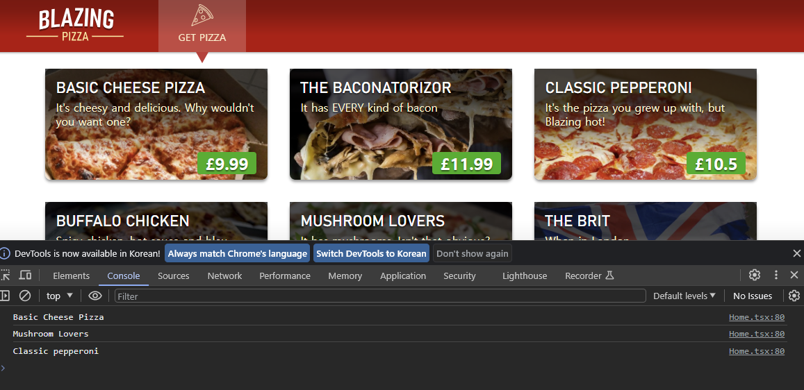
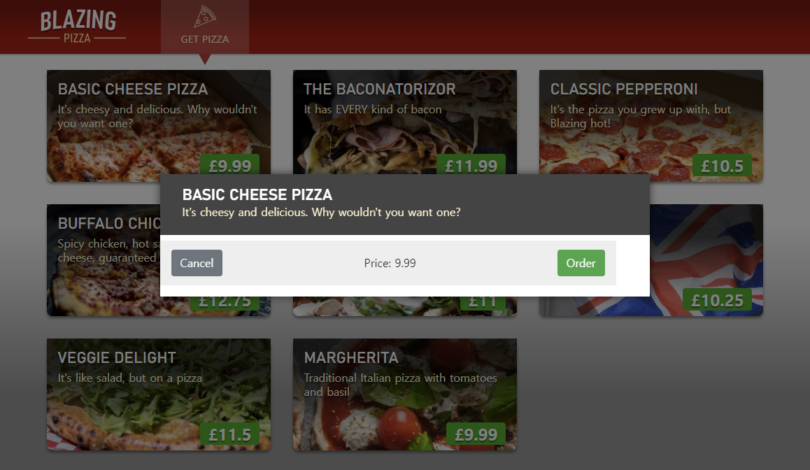

> node_modules 폴더가 없거나 실행이 잘 안된다면<br>
> [README.md](..\README.md#먼저-해야할-일)파일을 참조하셔서 node_modules를 설치해야 합니다.

# 01-components
피자를 선택하고 토핑을 추가하여 내가 주문할 피자를 만들어 보는 섹션 입니다.

## 이벤트 헨들링
사용자가 피자 메뉴를 클릭하면 내 기호에 맞게 크기를 변경하고, 옵션을 선택할 대화상자를 나타나게 합니다.<br>
`../src/Home.tsx` 파일에서 `onClick` 이벤트를 추가합니다.
`interface`와 `onClick` 함수도 추가했습니다.
```tsx
interface Pizza {
  id: number;
  name: string;
  description: string;
  imageUrl: string;
  basePrice: number;
}
export default function Home() {
  const onClick = (pizza: Pizza) => {
    console.log(pizza.name);
  };
  return (
    <PizzaCards>
      {pizzas.map((pizza) => (
        <PizzaItem
          key={pizza.id}
          imgUrl={pizza.imageUrl}
          onClick={() => onClick(pizza)}
        >
          <div className="pizza-info">
            <div className="pizza-title">{pizza.name}</div>
            <div className="pizza-description">{pizza.description}</div>
            <div className="pizza-price">£{pizza.basePrice}</div>
          </div>
        </PizzaItem>
      ))}
    </PizzaCards>
  );
}
```
브라우저에서 F12번을 누르고, console창을 연 다음 피자를 클릭하면 console창에 피자 이름이 표시됩니다.


`onClick`함수를 통해 console.log에 `pizza`가 전달되고 있음을 확인했습니다.<br>

---
이번에는 전달받은 피자를 `selectedPizza`라는 변수에 할당해주고 `useState`를 통해 관리해 주도록 하겠습니다.<br>
`Home.tsx`파일에 `useState`를 추가해 줍니다.
```tsx
import { useState } from "react";
```
그리고 `Home()` 함수에 관리할 `state`를 두개 넣어주겠습니다.
```tsx
export default function Home() {
  //선택(클릭)한 피자 입니다.
  const [selectedPizza, setSelectedPizza] = useState<Pizza | null>(null);
  //클릭한 이후 모달이 보여져야 하는지 여부에 대한 Boolean 값입니다.
  const [showSelectPizzaDialog, setShowSelectPizzaDialog] = useState(false);
  //onClick 함수를 이해하기 쉽게 openConfigureDialog로 이름을 바꾸어 주겠습니다.
  const openConfigureDialog = (pizza: Pizza) => {
    //클릭한 피자가 선택되었습니다.
    setSelectedPizza(pizza);
    //showSelectPizzaDialog 값이 'true'로 재할당 됩니다.
    setShowSelectPizzaDialog(true);
  };
  return (
    <PizzaCards>
      {pizzas.map((pizza) => (
        <PizzaItem
          key={pizza.id}
          imgUrl={pizza.imageUrl}
          //onClick에서 openConfigureDialog으로 변명해주었습니다.
          onClick={() => openConfigureDialog(pizza)}
        >
          <div className="pizza-info">
            <div className="pizza-title">{pizza.name}</div>
            <div className="pizza-description">{pizza.description}</div>
            <div className="pizza-price">£{pizza.basePrice}</div>
          </div>
        </PizzaItem>
      ))}
    </PizzaCards>
  );
}
```

지금까지는 클릭한 피자를 담을 `selectedPizza`변수와 모달을 띄울지를 결정하는 `showSelectedPizzaDialog`변수를 만들고 할당하였습니다.<br>
이번에는 `ConfigurePizzaDialog.tsx`파일을 만들어서 모달용 Dialog를 만들어보겠습니다.<br>
path : `..src/screens/ConfigurePizzaDialog.tsx`
```tsx
export default function ConfigurePizzaDialog()  {
  return <div></div>;
}
```
이 `Dialog`는 `Pizza`를 변수로 받아와야 합니다.<br>
`Home.tsx`에 있는 `interface Pizza`를 똑값이 구현해 주어야 하죠.<br>
중복되는 내용이 각각 다른 파일에 사용이 될 경우, 하나의 파일에서 수정이 되면 다른 파일에서 문제가 생깁니다.<br>
따라서 `interface Pizza`를 별도로 빼도록 하겠습니다.<br>
이번에는 `IPizza.ts`파일을 만들어주겠습니다.<br>
path : `..src/interface/IPizza.ts`
```tsx
export default interface IPizza {
    id: number;
    name: string;
    description: string;
    imageUrl: string;
    basePrice: number;
}
```
`Home.tsx`파일에서 Pizza 인터페이스를 삭제하고, 기존에 `Pizza`를 모두 `IPizza`로 변경하겠습니다.<br>
```tsx
import IPizza from "interface/IPizza";
  //---
  const [selectedPizza, setSelectedPizza] = useState<IPizza | null>(null);
  //---
  const openConfigureDialog = (pizza: IPizza) => {
```
이제 `ConfigurePizzaDialog.tsx` 파일로 돌아옵니다.<br>
인터페이스를 적용하고 CSS-in-JS를 적용하기 위해 `IPizza`와 `styled`를 `import` 해줍니다.
```tsx
import IPizza from "interface/IPizza";
import styled from "styled-components";
```
모달에서 사용할 CSS-in-JS가 적용된 컴포넌트를 추가하겠습니다.
```tsx

const Container = styled.div`
  position: absolute;
  top: 0;
  bottom: 0;
  left: 0;
  right: 0;
  background-color: rgba(0, 0, 0, 0.5);
  z-index: 2000;
  display: flex;
  animation: dialog-container-entry 0.2s;
`;
const Dialog = styled.div`
  background-color: white;
  box-shadow: 0 0 12px rgba(0, 0, 0, 0.6);
  display: flex;
  flex-direction: column;
  z-index: 2000;
  align-self: center;
  margin: auto;
  width: 700px;
  max-height: calc(100% - 3rem);
  animation: dialog-entry 0.4s;
  animation-timing-function: cubic-bezier(0.075, 0.82, 0.165, 1);
`;
const Title = styled.div`
  background-color: #444;
  color: #fff2cc;
  padding: 1.3rem 2rem;
  & h2 {
    color: white;
    font-size: 1.4rem;
    margin: 0;
    font-family: "Bahnschrift", Arial, Helvetica, sans-serif;
    text-transform: uppercase;
    line-height: 1.3rem;
  }
`;
const Body = styled.form`
  flex-grow: 1;
  padding: 0.5rem 3rem 1rem 0;
`;
const Buttons = styled.div`
  height: 4rem;
  flex-shrink: 0;
  display: flex;
  align-items: center;
  background-color: #eee;
  padding: 0 1rem;
`;
```
그리고 `ConfigurePizzaDialog`함수도 변경합니다.
```tsx
// props로 pizza를 받기 위해 IPizzaProps를 선언해줍니다.
interface IPizzaProps {
  pizza: IPizza;
}
export default function ConfigurePizzaDialog({ pizza }: IPizzaProps) {
  return (
    <Container>
      <Dialog>
        <Title>
          <h2>{pizza.name}</h2>
          {pizza.description}
        </Title>
        <Body>
          <Buttons>
            <button className="btn btn-secondary mr-auto">Cancel</button>
            <span className="mr-center">
              Price: <span className="price">{pizza.basePrice}</span>
            </span>
            <button className="btn btn-success ml-auto">Order</button>
          </Buttons>
        </Body>
      </Dialog>
    </Container>
  );
}
```
이제 `Home.tsx`로 돌아와서 모달이 보여지는 부분을 추가해 줍니다.
```tsx
//우선 ConfigurePizzaDialog를 import하고
import ConfigurePizzaDialog from "./ConfigurePizzaDialog";

//----
export default function Home() {
    //----
        </PizzaItem>
      ))}
      {/* 모달이 보여지는 부분입니다. 단축평가를 통해 ConfigurePizzaDialog를 띄워줍니다. */}
      {/* ConfigurePizzaDialog에 selectedPizza도 전달하고 있습니다. */}
      {showSelectPizzaDialog && selectedPizza && (
        <ConfigurePizzaDialog pizza={selectedPizza} />
      )}
    </PizzaCards>
  );
```

이제 화면에서 피자를 클릭해 보세요. 모달 화면이 뜹니다.


현재는 `Cancel`과 `Order` 버튼에 아무런 이벤트를 넣지 않았기 때문에, 클릭하면 화면이 다시 렌더링이 됩니다.